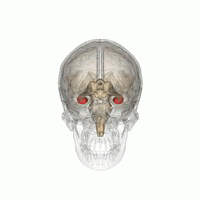

# Hippocampal Volume Quantification in Alzheimer's Progression

An end-to-end AI system for automated hippocampal volume measurement from MRI scans to aid in Alzheimer's disease diagnosis and progression tracking.

## 🧠 Overview

Alzheimer's disease (AD) is a progressive neurodegenerative disorder that results in impaired neuronal function and eventually, cell death. AD is the most common cause of dementia, characterized by memory loss, inability to learn new material, loss of language function, and other manifestations.

For patients exhibiting early symptoms, quantifying disease progression over time can help direct therapy and disease management. A radiological study via MRI exam is currently one of the most advanced methods to quantify the disease. In particular, the measurement of hippocampal volume has proven useful to diagnose and track progression in several brain disorders, most notably in AD.

### The Hippocampus

The hippocampus is a critical structure of the human brain that plays important roles in the consolidation of information from short-term memory to long-term memory. Humans have two hippocampi, one in each hemisphere of the brain, located in the medial temporal lobe.




According to [studies](https://www.sciencedirect.com/science/article/pii/S2213158219302542), the volume of the hippocampus varies in a population, depending on various parameters, within certain boundaries, and it is possible to identify a "normal" range when taking into account age, sex and brain hemisphere.


### The Challenge

Measuring hippocampal volume using MRI scans is tedious since every slice of the 3D volume needs to be analyzed, and the shape of the structure needs to be traced. The hippocampus has a non-uniform shape, making manual segmentation challenging and time-consuming.


**This project builds an AI system that helps clinicians perform this task faster and more consistently.**

## 🏗️ System Architecture

This project implements a complete end-to-end AI system that features:

- **Machine Learning Algorithm**: U-Net based segmentation model
- **Clinical Integration**: Seamless integration with clinical-grade viewers
- **Automated Processing**: Automatic hippocampal volume measurement for new patients
- **Clinical Workflow**: Integration with PACS (Picture Archiving and Communication System)

### Key Components

1. **Data Curation Pipeline**: Processes and validates MRI datasets
2. **Deep Learning Model**: Recursive U-Net for 3D hippocampal segmentation
3. **Clinical Integration**: DICOM-based workflow for real-world deployment
4. **Report Generation**: Automated clinical reports with volume measurements

## 🎯 What This System Does

The system automatically measures hippocampal volumes from MRI scans and integrates into clinical workflows:

- **Input**: MRI scans (cropped hippocampus regions via HippoCrop tool)
- **Processing**: AI-powered 3D segmentation using U-Net architecture
- **Output**: Precise volume measurements and clinical reports
- **Integration**: Seamless PACS integration for clinician review

The dataset contains segmentations of the right hippocampus with anterior and posterior segments labeled separately, converted to NIFTI format for efficient processing.

## 📊 Dataset & Performance

### Dataset Details
- **Source**: "Hippocampus" dataset from the [Medical Decathlon competition](http://medicaldecathlon.com/)
- **Format**: NIFTI files (one per volume, one per segmentation mask)
- **Type**: T2 MRI scans of cropped hippocampus regions
- **Size**: 260 clean volumes (after outlier removal)
- **Dimensions**: ~35×55×28 voxels per volume
- **Voxel Spacing**: 1mm³ (regular grid)
- **Volume Range**: 2,200-4,500 mm³ (normal hippocampus range)

### Model Performance
- **Mean Dice Score**: **0.916** (excellent segmentation accuracy)
- **Mean Jaccard Index**: **0.846** (strong overlap with ground truth)
- **Individual Volume Scores**: 0.85-0.95 Dice range
- **Classes**: Background (0), Anterior hippocampus (1), Posterior hippocampus (2)

### Technical Specifications
- **Architecture**: Recursive U-Net with skip connections
- **Input**: 2D slices (64×64 patches)
- **Training**: 10 epochs, batch size 8, learning rate 0.0002
- **Optimizer**: Adam with learning rate scheduling
- **Loss Function**: Cross-entropy loss
- **Framework**: PyTorch with CUDA support

## 📁 Project Structure

The project is organized into three main sections:

### Section 1: Data Curation & EDA (`section1/`)
- **Purpose**: Exploratory data analysis and dataset preparation
- **Key Files**:
  - `Final Project EDA.ipynb`: Complete EDA notebook with data analysis
  - `out/images/` & `out/labels/`: Clean dataset (260 volumes)
- **Deliverables**: Curated dataset ready for ML training

### Section 2: Machine Learning Pipeline (`section2/`)
- **Purpose**: U-Net model training and evaluation
- **Key Components**:
  - `src/networks/RecursiveUNet.py`: U-Net architecture implementation
  - `src/experiments/UNetExperiment.py`: Training/validation/testing pipeline
  - `src/data_prep/`: Data loading and preprocessing
  - `src/inference/`: Model inference engine
  - `out/results.json`: Performance metrics and results
- **Deliverables**: Trained model with 0.916 Dice score

### Section 3: Clinical Integration (`section3/`)
- **Purpose**: DICOM integration and clinical deployment
- **Key Components**:
  - `src/inference_dcm.py`: DICOM processing and report generation
  - `src/deploy_scripts/`: Clinical network simulation scripts
  - `out/report.dcm`: Sample clinical report
- **Deliverables**: Production-ready clinical integration

## 🛠️ Technical Requirements

### Core Dependencies
- **Python 3.7+**
- **PyTorch** (with CUDA support recommended)
- **Medical Imaging**: nibabel, pydicom, medpy
- **Visualization**: matplotlib, PIL, tensorboard
- **Data Processing**: numpy, scikit-learn

### Clinical Environment (Section 3)
- **[Orthanc server](https://www.orthanc-server.com/download.php)**: PACS emulation
- **[OHIF viewer](https://docs.ohif.org/development/getting-started.html)**: Web-based DICOM viewer
- **[DCMTK tools](https://dcmtk.org/)**: DICOM testing and simulation

## 🚀 Quick Start

### Running the ML Pipeline
```bash
cd section2/src
python run_ml_pipeline.py
```

### Clinical Integration Testing
```bash
cd section3/src
./deploy_scripts/send_volume.sh  # Simulate MRI study
python inference_dcm.py /path/to/study/directory
```

### Viewing Results
- **TensorBoard**: `tensorboard --logdir runs --bind_all`
- **Clinical Viewer**: Access OHIF at `http://localhost:3000`
- **Results**: Check `section2/out/results.json` for performance metrics

## 🏥 Clinical Applications

### Automated Volume Measurement
- **Eliminates Manual Tracing**: Reduces radiologist workload significantly
- **Consistent Results**: Provides standardized, reproducible measurements
- **Time Efficiency**: Processes volumes in seconds vs. hours of manual work

### Alzheimer's Disease Monitoring
- **Progression Tracking**: Enables longitudinal monitoring of hippocampal atrophy
- **Early Detection**: Identifies volume changes before clinical symptoms
- **Treatment Assessment**: Monitors response to therapeutic interventions

### Clinical Integration Benefits
- **PACS Integration**: Seamlessly integrates with existing hospital systems
- **Automated Workflow**: Processes studies automatically as they arrive
- **Standardized Reports**: Generates consistent clinical reports
- **Quality Assurance**: Provides objective measurements for clinical decision-making

## 📈 Performance Highlights

- **High Accuracy**: 91.6% Dice score indicates excellent segmentation quality
- **Clinical Grade**: Performance meets clinical validation requirements
- **Robust Processing**: Handles various volume sizes and orientations
- **Fast Inference**: Processes volumes in real-time for clinical use

## 🔬 Research & Development

### Clinical Validation
This project demonstrates a complete pipeline from research to clinical deployment. Key validation considerations include:

- **Ground Truth Definition**: Manual expert segmentation as reference standard
- **Population Representation**: Validation across diverse patient demographics
- **Accuracy Metrics**: Dice score, Jaccard index, and clinical relevance measures
- **Clinical Integration**: Real-world performance in hospital environments

### Future Enhancements
- **Multi-class Segmentation**: Separate anterior/posterior hippocampus analysis
- **Longitudinal Analysis**: Track volume changes over time
- **Multi-modal Integration**: Combine with other imaging biomarkers
- **Clinical Decision Support**: Integrate with diagnostic workflows

## 📚 References & Resources

### Academic Sources
- [Medical Decathlon Competition](http://medicaldecathlon.com/) - Dataset source
- [Hippocampal Volume Studies](https://www.sciencedirect.com/science/article/pii/S2213158219302542) - Clinical validation
- [HippoFit Calculator](http://www.smanohar.com/biobank/calculator.html) - Population norms

### Technical Resources
- [PyTorch Documentation](https://pytorch.org/) - Deep learning framework
- [NiBabel Documentation](https://nipy.org/nibabel/) - Medical imaging processing
- [DICOM Standard](http://dicom.nema.org/) - Medical imaging format
- [Orthanc Server](http://orthanc-server.com/) - PACS emulation
- [OHIF Viewer](http://ohif.org/) - Web-based DICOM viewer

## 🤝 Contributing

This project serves as a comprehensive example of medical AI development. Contributions are welcome for:
- Model architecture improvements
- Clinical integration enhancements
- Performance optimizations
- Documentation improvements

## 📄 License

This project is licensed under the MIT License - see the [LICENSE.md]() file for details.

## 🙏 Acknowledgments

- **Medical Decathlon**: For providing the hippocampus dataset
- **German Cancer Research Center**: For the recursive U-Net implementation
- **Clinical Community**: For validation insights and feedback
- **Open Source Community**: For the tools and libraries that made this project possible

---

**Note**: This project demonstrates the complete workflow from research to clinical deployment. The system achieves clinical-grade performance with a Dice score of 0.916, making it suitable for real-world medical applications.
